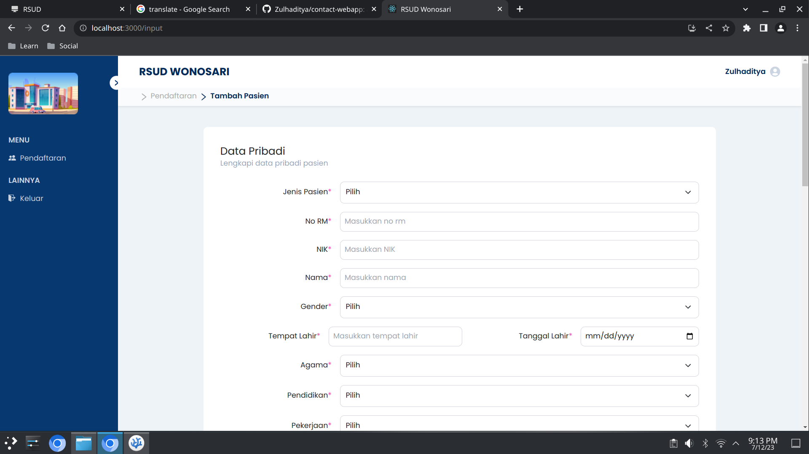

# RSUD Website

> A patient data management website using MERN Stack.
> Link to website [_here_](https://rsudwonosari.netlify.app/).

## Table of Contents

- [General Info](#general-information)
- [Technologies Used](#technologies-used)
- [Features](#features)
- [Screenshots](#screenshots)
- [Setup](#setup)
- [Project Status](#project-status)
- [Room for Improvement](#room-for-improvement)
- [Contact](#contact)

## General Information

- Fully functionality CRUD and search function based on database.
- This project is a case study of website development at Wonosari Hospital.

## Technologies Used

- MongoDB - version 6.0.7
- Express - version 4.18.2
- React - version 18.2.0
- Node.js - version 18.13.0

## Features

- Admin login.
- Create, Read, Update, and Delete patient data.
- Clean and simple frontend design.
- Sort data by date.
- Search data by name and clinic.
- Pagination data tables using react-pagination.

## Screenshots





## Setup

To run this project, install it locally using npm:

```bash
# clone this repository
git clone git@github.com:Zulhaditya/contact-webapp.git

# install server dependencies
cd server
npm install
npm start

# install client dependencies
cd client
npm install
npm start
```

- Open [http://localhost:3000](http://localhost:3000) with your browser to see the result.
- Username: **admin**
- Password: **admin123**

## Project Status

Project is: _under development._ <!-- / _complete_ / _no longer being worked on_. reason ? -->

## Room for Improvement

- Improve for mobile design.
- Add validation for each form input patient.

## Acknowledgements

- If you want to see the design, you can visit the following [link](https://shorturl.at/sxCQ3).

## Contact

Created by [@Zulhaditya](https://zulhaditya.vercel.app) - feel free to contact me!
